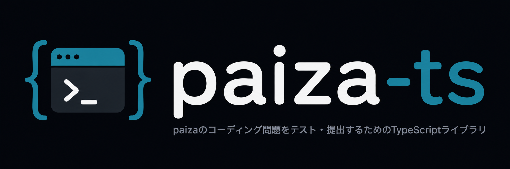

# paiza-ts

[](https://badge.fury.io/js/@vrcalphabet%2Fpaiza-ts)
[](https://www.typescriptlang.org/)
[](https://opensource.org/licenses/MIT)



TypeScriptでpaizaのコーディング問題をテスト・提出するためのライブラリ

<div><video controls src="https://github.com/user-attachments/assets/bc8f02b0-991c-47bb-8837-105b01484634" muted="false"></video></div>

## 推奨要件

- Node.js v25.x以上
- Google Chrome 136以上

## 使い方

使い方はとても簡単です。

任意の場所に**フォルダを作成**して、そのフォルダ内で以下のコマンドを実行するだけです。

```bash
npm create paiza-ts
```

依存関係のインストールが終わると、Google Chrome が起動し、 paiza\.jp のタブが自動で開かれます。

もし Google Chrome を閉じてしまった場合は、以下のコマンドを実行します。

```bash
npm start
```

通常と同じようにチャレンジ問題を開いた後、TypeScriptコードをVSCodeに書き込んで提出ボタンを押すとトランスパイルされたコードが提出されます。

## 貢献

プロジェクトへの貢献を歓迎します！以下のルールに従うと，あなたの貢献がスムーズになります！

### Issue / PR

Issueを立てる際は，バグ報告・機能要望のどちらかを明記してください。
PRの説明には，目的・変更点・影響範囲・サンプルコードがあるとありがたいです。

**※スクリーンショットを添付する際は、チャレンジ問題の問題文が画像に含まれていないことを確認してください。**

## ライセンス

MIT License

詳細は[LICENSE](./LICENSE)ファイルを参照してください。

## 変更履歴・リリース情報

### v1.0.0 (2026-05-17)

- 初回リリース
